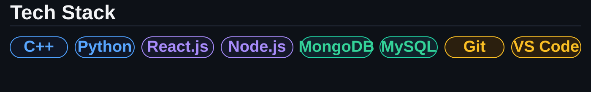

##  What I'm Up To

- 🔭 Currently working on **DSA problems in C++ every day**
- 🌱 Exploring **Web Development** and **Machine Learning**
- 💻 Practicing on **competitive programming** platforms
- 🎯 Goal: Land a role at a top tech company

###
##  Lets Connect 

	<table>
		<tr>
			<td></td>
			<td></td>
			<td></td>
			<td></td>
			<td></td>
			<td></td>
		</tr>
	</table>

###

## Tech Stack

	

###

	
	  
	
	  
	

###

<picture>
	<source media="(prefers-color-scheme: dark)" srcset="https://raw.githubusercontent.com/VAGISHA-47/VAGISHA-47/output/pacman-contribution-graph-dark.svg">
	<source media="(prefers-color-scheme: light)" srcset="https://raw.githubusercontent.com/VAGISHA-47/VAGISHA-47/output/pacman-contribution-graph.svg">
	
</picture>

